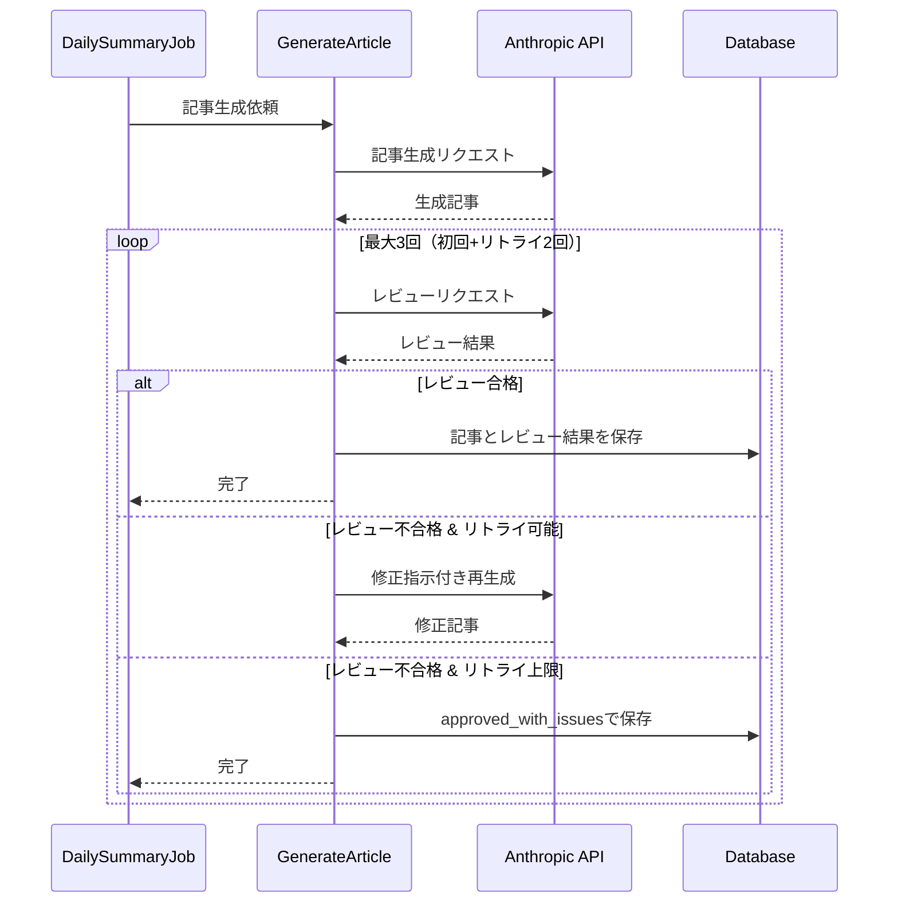

# 機能設計書: AI生成記事品質レビューシステム

**文書バージョン**: 1.0
**作成日**: 2026-01-07
**プロジェクト名**: DiffDaily
**対象機能**: AI生成記事の品質レビュー機能

---

## 1. 文書の目的

本文書は、「AI生成記事品質レビューシステム」の機能設計を記述する。要件定義書で定義された要件を、実装可能な設計レベルで具体化する。

---

## 2. 参照ドキュメント

- [要件定義書: AI生成記事品質レビューシステム](../requirements/quality-review-system.md)

---

## 3. 機能概要

### 3.1 目的

GitHubのPull Request情報から自動生成される技術記事について、AIによる品質レビューを実施し、評価結果を記録・表示することで記事の信頼性を担保する。

### 3.2 スコープ

本設計書では、以下の機能を対象とする:

- 記事生成時の自動レビュー処理
- レビュー結果の記録
- レビュー結果の表示
- 品質不足時の自動リトライ

---

## 4. システム構成

### 4.1 処理の全体フロー



### 4.2 主要な処理コンポーネント

#### 4.2.1 記事生成・レビューアクション

**責務**:
- Pull Request情報から記事を生成する
- 生成された記事を品質レビューする
- レビュー不合格時に記事を再生成する
- レビュー結果を構造化データとして返却する

**入力**:
- リポジトリ名
- Pull Request情報（タイトル、URL、番号、差分）
- リポジトリURL（オプション）

**出力**:
- 記事本文（Markdown）
- 要約文
- レビューステータス
- レビュー実施回数
- レビュー詳細情報
- レビュワーモデル名

#### 4.2.2 日次サマリージョブ

**責務**:
- 記事生成アクションを呼び出す
- 生成された記事とレビュー結果をデータベースに保存する

**処理フロー**:
1. Pull Request情報を取得
2. 記事生成アクションを実行
3. 返却された記事とレビュー結果を保存
4. ログ出力

---

## 5. 品質レビュー処理

### 5.1 レビュー観点

システムは、以下の3つの観点で記事を評価する:

#### 5.1.1 ガイドライン準拠

**評価内容**:
- 記事構成（Title、Context、Technical Detail）の適切性
- DiffDaily Styleガイドへの準拠
- カスタムMarkdown構文の適切な使用
- 対象読者（専門知識を持つエンジニア）への適合性

**サブ観点**:
- 記事構成(Title、Context、Technical Detail)
- DiffDaily Styleガイド準拠
- カスタムMarkdown活用
- 対象読者への適合性

#### 5.1.2 技術的整合性

**評価内容**:
- 技術用語の正確性
- コード例の正確性と実際のDiffとの整合性
- 技術的な説明の正確性

**サブ観点**:
- 技術用語の正確性
- コード例の正確性
- 説明の技術的正確性

#### 5.1.3 PR内容との整合性

**評価内容**:
- PRのタイトル・説明と記事内容の一致
- 実際の差分内容の正確な反映
- 根拠のない推測の排除

**サブ観点**:
- タイトル・説明の一致
- Diff内容の正確な反映
- 推測の排除

### 5.2 評価ステータス

各観点について、以下のステータスを判定する:

| ステータス | 意味 | 処理への影響 |
|-----------|------|------------|
| pass | 問題なし | 承認 |
| warning | 改善推奨だが公開可能 | 承認（注意喚起） |
| fail | 修正必須 | リトライまたは問題付き承認 |

### 5.3 レビュープロンプト

AIに対して、以下の情報を含むプロンプトを送信する:

**入力情報**:
- 生成された記事本文
- 元のPR情報（リポジトリ、タイトル、URL、番号）
- 記事生成時に使用したシステムプロンプト

**要求する出力**:
- 総合承認判定（approved: true/false）
- 各観点の評価（status、feedback）
- 検出された問題のリスト（category、severity、description、suggestion）
- 総合的なフィードバック

### 5.4 レビュー結果の構造

AIから返却されるレビュー結果は、以下の構造を持つ:

```
{
  approved: boolean,
  criteria_evaluation: {
    guideline: { status, feedback },
    technical: { status, feedback },
    pr_consistency: { status, feedback }
  },
  issues: [
    {
      category: "guideline" | "technical" | "pr_consistency",
      severity: "critical" | "warning",
      description: string,
      suggestion: string
    }
  ],
  overall_feedback: string
}
```

### 5.5 リトライ処理

**リトライ条件**:
- レビュー結果が `approved: false` の場合
- リトライ回数が上限（2回）未満の場合

**リトライ時の動作**:
1. レビュー結果から修正指示を生成
2. 修正指示を含めて記事を再生成
3. 再生成された記事を再度レビュー

**修正指示の内容**:
- 総合フィードバック
- 検出された問題のカテゴリ、重要度、説明、修正提案

**リトライ上限到達時**:
- 記事を `approved_with_issues` ステータスで承認
- 検出された問題をすべて記録
- 記事は公開される

---

## 6. データ設計

### 6.1 記事テーブル（posts）

レビュー関連の情報を記録するフィールド:

| フィールド名 | データ型 | 必須 | デフォルト | 説明 |
|-------------|---------|------|-----------|------|
| review_status | string (enum) | ○ | not_reviewed | レビューステータス |
| review_attempts | integer | ○ | 0 | レビュー実施回数 |
| review_issues | json | - | null | 検出された問題のリスト |
| reviewer_model | string | - | null | レビュワーモデル名 |
| review_details | json | - | null | レビュー詳細情報 |

#### 6.1.1 review_status（レビューステータス）

取りうる値:

| 値 | 説明 |
|----|------|
| not_reviewed | レビュー未実施 |
| approved | 1回目で承認 |
| approved_with_retry | リトライ後に承認 |
| approved_with_issues | 問題ありだが上限到達後に承認 |

#### 6.1.2 review_issues（検出された問題）

JSON配列。各要素は以下の構造:

```
{
  category: "guideline" | "technical" | "pr_consistency",
  severity: "critical" | "warning",
  description: "問題の具体的な説明",
  suggestion: "修正提案"
}
```

#### 6.1.3 review_details（レビュー詳細情報）

JSON形式。以下の構造:

```
{
  criteria: [
    {
      name: "観点名",
      key: "guideline" | "technical" | "pr_consistency",
      description: "観点の説明",
      sub_criteria: ["サブ観点1", "サブ観点2", ...],
      status: "pass" | "warning" | "fail",
      feedback: "具体的な評価コメント"
    }
  ],
  evaluation: {
    guideline: [問題のリスト],
    technical: [問題のリスト],
    pr_consistency: [問題のリスト]
  },
  overall_feedback: "総合的なフィードバック",
  approved: boolean
}
```

---

## 7. 画面設計

### 7.1 記事詳細ページ - 品質レビュー結果セクション

#### 7.1.1 表示条件

- `review_status` が `not_reviewed` 以外の場合に表示

#### 7.1.2 表示内容

**基本情報**:
- Review Status: レビューステータスバッジ
- Review Count: レビュー実施回数（回数+改善経過の注記）
- Reviewed by: レビュワーモデル名（"[モデル名] for DiffDaily"形式）

**レビュー観点** (`review_details` が存在する場合):

各観点について以下を表示:
- 観点名
- ステータスバッジ（PASS/WARNING/FAIL）
- 観点の説明
- 具体的な評価フィードバック（フィードバックが存在する場合）
- サブ観点のリスト

**検出された問題** (`approved_with_issues` かつ `review_issues` が存在する場合):

各問題について以下を表示:
- カテゴリ（titleize）
- 重要度（CRITICAL/WARNING）
- 重要度に応じたアイコン
- 問題の説明
- 修正提案（存在する場合）

注記:
- 「上記の問題は検出されましたが、記事は公開基準を満たしています」

#### 7.1.3 視覚的な表現

**色分け**:
- PASS: 緑色（green-100/green-800、border-green-200）
- WARNING: 黄色（yellow-100/yellow-800、border-yellow-200）
- FAIL: 赤色（red-100/red-800、border-red-200）

**レイアウト**:
- セクション全体: 緑のグラデーション背景（from-green-50 to-emerald-50）
- 各観点: 個別のカード形式
- 問題: リスト形式、アイコン付き

**スペーシング**:
- メタデータセクションと同じパディング（p-5）
- セクション間の区切り（border-t border-green-200）
- 適切なマージン（mt-4 pt-4）

---

## 8. ビジネスロジック

### 8.1 レビューステータスの決定ロジック

**入力**:
- リトライ回数
- 承認フラグ（approved）

**ロジック**:

```
IF リトライ回数 = 0 AND 承認 THEN
  review_status = "approved"
ELSE IF リトライ回数 > 0 AND 承認 THEN
  review_status = "approved_with_retry"
ELSE
  review_status = "approved_with_issues"
END IF
```

### 8.2 問題の観点別分類

**入力**:
- 検出された問題のリスト（issues）

**処理**:
- 各問題の `category` フィールドに基づいて分類
- 結果を観点別のハッシュとして構造化

**出力**:
```
{
  guideline: [guideline関連の問題],
  technical: [technical関連の問題],
  pr_consistency: [pr_consistency関連の問題]
}
```

### 8.3 レビュー詳細情報の構築

**入力**:
- レビュー結果（raw_response）

**処理**:
1. レビュー結果から各観点の評価情報を抽出
2. 3つの観点それぞれについて以下を設定:
   - 観点名、キー、説明
   - サブ観点のリスト（固定）
   - ステータス（pass/warning/fail）
   - フィードバック
3. 問題を観点別に分類
4. 総合フィードバックと承認フラグを設定

**出力**:
- review_details構造（セクション6.1.3参照）

---

## 9. エラーハンドリング

### 9.1 レビュー処理失敗時

**発生条件**:
- AIリクエストの失敗
- JSONパースエラー
- ネットワークエラー

**処理**:
1. エラーをログに記録
2. レビュー結果を以下として扱う:
   - approved: true
   - issues: []
   - overall_feedback: "Review error occurred"
   - reviewer_model: "Review Error"
3. 記事生成処理を継続（システムの可用性を優先）

**理由**:
- レビュー機能の障害によって記事生成全体を止めない
- 記事は後から手動でレビュー可能

### 9.2 リトライ上限到達時

**処理**:
1. 最終レビュー結果をすべて記録
2. review_status を "approved_with_issues" に設定
3. 検出された問題をすべて保存
4. 記事を公開

**表示**:
- 問題セクションに注記を表示
- 読者に対して問題の存在を明示

---

## 10. 制約事項と留意点

### 10.1 技術的制約

- **同期処理**: レビューは記事生成の一部として同期的に実行される
- **AIモデル依存**: レビューの品質はAIモデルの性能に依存する
- **レビュー時間**: 記事生成時間に加えてレビュー時間が必要
- **API制限**: Anthropic APIの利用制限に依存する

### 10.2 ハルシネーション検出の限界

レビューAI自身もハルシネーションを起こす可能性があるため、以下の点に留意:

- **完全性の非保証**: すべてのハルシネーションを検出できるわけではない
- **参考情報としての位置づけ**: レビュー結果は参考情報として扱う
- **読者の責任**: 技術的な正確性の最終確認は読者に委ねられる
- **透明性の提供**: レビュー観点と結果を明示することで判断材料を提供

### 10.3 運用上の留意点

- **リトライコスト**: リトライによりAI API利用コストが増加する
- **処理時間**: レビューとリトライにより記事生成時間が延長される
- **観点の固定**: レビュー観点は3つに固定（拡張性なし）
- **後方互換性**: 既存記事は `not_reviewed` ステータスを維持

---

## 11. 今後の拡張可能性

以下の拡張は現時点では対象外だが、将来的に検討可能:

### 11.1 レビュー観点のカスタマイズ

- リポジトリ別のレビュー基準設定
- 動的なレビュー観点の追加・削除

### 11.2 レビュー履歴の管理

- 同一記事の複数バージョン比較
- レビュー結果の履歴表示

### 11.3 レビューモデルの選択

- 用途に応じた異なるAIモデルの選択
- コスト・品質のトレードオフ

### 11.4 人手レビューとの統合

- AIレビュー後の人手レビューワークフロー
- レビュー結果のフィードバックループ

---

## 12. 補足情報

### 12.1 表示形式の統一

レビュー結果セクションは、記事メタデータセクションと同じ体裁で統一:

- **ラベル**: 英語表記（Review Status, Reviewed by等）
- **パディング**: p-5
- **フォントサイズ**: text-sm（ラベル）、text-xs（詳細）
- **レビュワー情報**: 記事生成モデルと同じ書式

### 12.2 定数管理

以下の定数を管理:

- **MODEL_NAME**: 記事生成モデル名（"Claude Sonnet 4.5"）
- **REVIEWER_MODEL_NAME**: レビューモデル名（"Claude Sonnet 4.5"）
- **MAX_RETRY_COUNT**: 最大リトライ回数（2）

変更時は定数を更新するだけで全体に反映される。

---

## 変更履歴

| バージョン | 日付 | 変更内容 | 作成者 |
|-----------|------|----------|--------|
| 1.0 | 2026-01-07 | 初版作成 | - |
