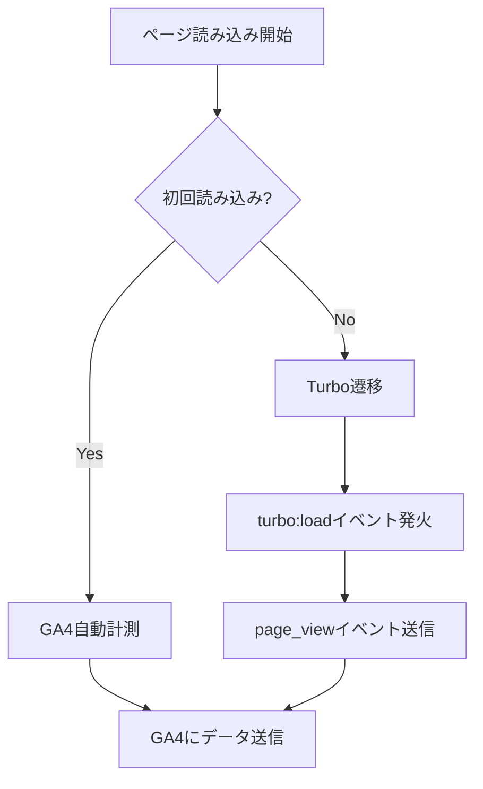

# Google Analytics導入 機能設計書

**機能名**: Google Analytics導入
**バージョン**: 1.0
**作成日**: 2026年1月10日
**更新日**: 2026年1月10日

> **設計書作成ガイドライン**
>
> この機能設計書は、実装の詳細に影響されないコアドメインの設計を記載します。
> 具体的なクラス設計や実装詳細は、実装中の改善によって変化するため、
> 以下の点を重視して作成してください：
>
> - **責務の明確化**: 何をする処理かを明確に定義
> - **入出力の仕様**: 処理に必要な入力と期待される出力
> - **処理フローの概要**: 大まかな処理手順（実装方法は含めない）
> - **抽象度の保持**: 具体的なクラス名・メソッド名は記載しない
> - **ドメイン知識の記録**: 業務ルールやビジネス制約を重視

## 1. 機能概要

### 1.1 目的

- Google Analytics 4（GA4）を導入し、ユーザーの流入元とページビューを計測する
- Turbo Driveによるページ遷移にも対応し、正確なアクセス計測を実現する

### 1.2 主要機能

1. **GA4スクリプト出力**: 測定IDが設定されている場合にGA4のトラッキングスクリプトを出力する
2. **ページビュー計測**: 初回読み込みおよびTurbo Driveによるページ遷移時にページビューを送信する
3. **環境変数による制御**: 測定IDを環境変数で設定可能にし、未設定時はスクリプトを出力しない

### 1.3 処理フロー概要

#### 1.3.1 サーバーサイド（HTML生成時）

1. 環境変数から測定IDを取得する
2. 測定IDが設定されている場合、GA4スクリプトタグをHTMLに含める
3. 測定IDが未設定の場合、GA4関連のスクリプトを一切出力しない

#### 1.3.2 クライアントサイド（ブラウザ実行時）

4. 初回ページ読み込み時、GA4がページビューを自動送信する
5. Turbo Driveによるページ遷移を検知する
6. ページ遷移時、GA4に新しいページビューを手動送信する

## 2. 設定要件

### 2.1 環境変数

| 環境変数名 | 必須 | 説明 | 形式 |
|-----------|------|------|------|
| GA_MEASUREMENT_ID | - | GA4測定ID | G-XXXXXXXXXX |

**動作仕様**:
- 設定あり: GA4スクリプトを出力し、計測を有効化
- 未設定または空: GA4スクリプトを出力しない

### 2.2 スクリプト出力条件

```
GA4スクリプト出力 = GA_MEASUREMENT_ID が設定されている場合 → 出力する
                   GA_MEASUREMENT_ID が未設定または空の場合 → 出力しない
```

## 3. ページビュー計測

### 3.1 計測タイミング

| タイミング | トリガー | 計測方法 |
|-----------|---------|---------|
| 初回読み込み | DOMContentLoaded | GA4自動計測 |
| Turboページ遷移 | turbo:load イベント | 手動でpage_viewイベント送信 |
| ブラウザ履歴操作 | popstate → turbo:load | 手動でpage_viewイベント送信 |

### 3.2 送信データ

ページビュー送信時に以下の情報をGA4に送信する：

| 項目 | 説明 |
|------|------|
| page_path | 現在のURLパス |
| page_location | 現在の完全なURL |
| page_title | ページタイトル |

### 3.3 Turbo Drive対応

#### 3.3.1 課題
- Turbo Driveはページ全体を再読み込みせずにコンテンツを差し替える
- 通常のGA4自動計測では、Turboによるページ遷移を検知できない

#### 3.3.2 解決策
- `turbo:load`イベントをリッスンする
- イベント発火時、GA4にページビューイベントを手動送信する
- 初回読み込み時の二重計測を防ぐため、初回は送信をスキップする

### 3.4 処理フロー



## 4. ビジネスルール

### 4.1 計測の有効/無効

#### 4.1.1 有効化条件
- 環境変数`GA_MEASUREMENT_ID`が設定されていること
- 値が空文字でないこと

#### 4.1.2 無効時の動作
- GA4関連のスクリプトタグを一切出力しない
- ブラウザへのリクエスト・処理負荷を発生させない

### 4.2 二重計測の防止

#### 4.2.1 初回読み込み
- GA4の自動計測機能に任せる
- JavaScriptからの手動送信は行わない

#### 4.2.2 Turboページ遷移
- `turbo:load`イベントで手動送信する
- 初回読み込み時は`turbo:load`が発火しても送信をスキップする

### 4.3 流入元トラッキング

- GA4標準の流入元トラッキング機能を利用する
- 追加の設定は不要（GA4が自動的に処理）

## 5. 対象外事項

以下は本設計の対象外とする：

- カスタムイベントトラッキング（リンククリック、コードコピー等）
- eコマーストラッキング
- ユーザー属性のカスタム設定
- Cookie同意バナーの実装
- Google Tag Managerの利用

---

**関連資料**:
- [Google Analytics導入 要件定義書](../requirements/google-analytics.md)
