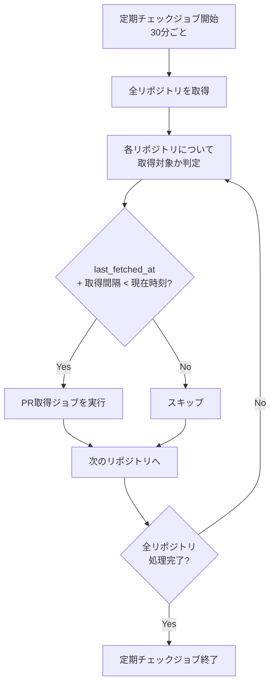

# インターバルベースPR取得機能 機能設計書

**機能名**: インターバルベースPR取得機能
**バージョン**: 1.0
**作成日**: 2026年1月10日
**更新日**: 2026年1月10日

> **設計書作成ガイドライン**
>
> この機能設計書は、実装の詳細に影響されないコアドメインの設計を記載します。
> 具体的なクラス設計や実装詳細は、実装中の改善によって変化するため、
> 以下の点を重視して作成してください：
>
> - **責務の明確化**: 何をする処理かを明確に定義
> - **入出力の仕様**: 処理に必要な入力と期待される出力
> - **処理フローの概要**: 大まかな処理手順（実装方法は含めない）
> - **抽象度の保持**: 具体的なクラス名・メソッド名は記載しない
> - **ドメイン知識の記録**: 業務ルールやビジネス制約を重視

## 1. 機能概要

### 1.1 目的

- PR取得処理を定時一括実行から、経過時間に基づく分散実行に変更する
- 監視対象リポジトリ増加時の負荷集中を回避し、スケーラビリティを確保する

### 1.2 主要機能

1. **定期チェック処理**: 30分ごとに全リポジトリの取得状況をチェックする
2. **取得対象判定**: 前回取得から取得間隔（24時間）が経過したリポジトリを特定する
3. **選択的PR取得**: 取得対象と判定されたリポジトリのみPR取得処理を実行する

### 1.3 処理フロー概要



## 2. 処理仕様

### 2.1 定期チェック処理

**責務**: 全リポジトリを走査し、取得が必要なリポジトリを特定してPR取得処理を起動する

**入力**:
- なし（定期実行により自動起動）

**出力**:
- 取得対象リポジトリに対するPR取得処理の起動

**処理手順**:
1. 全リポジトリを取得する
2. 各リポジトリについて取得対象判定を行う
3. 取得対象のリポジトリに対してPR取得処理を実行する
4. 個別リポジトリでエラーが発生しても、他のリポジトリの処理は継続する

### 2.2 取得対象判定

**責務**: リポジトリが現時点でPR取得を必要としているかを判定する

**入力**:
- リポジトリ情報（last_fetched_at含む）
- 取得間隔（24時間）

**出力**:
- 取得対象かどうかの真偽値

**判定ロジック**:

```
取得対象 = 以下のいずれかに該当する場合
  1. last_fetched_at が NULL（未取得）
  2. last_fetched_at + 取得間隔 <= 現在時刻
```

### 2.3 PR取得処理

既存のPR取得処理（DailySummaryJob）をそのまま利用する。変更なし。

## 3. 設定仕様

### 3.1 チェック間隔

| 項目 | 値 | 説明 |
|------|-----|------|
| チェック間隔 | 30分 | 定期チェックジョブの実行間隔 |

### 3.2 取得間隔

| 項目 | 値 | 説明 |
|------|-----|------|
| 取得間隔 | 24時間 | リポジトリごとのPR取得を行う最小間隔 |

## 4. ビジネスルール

### 4.1 取得タイミングの分散

#### 4.1.1 自然分散の原理
- リポジトリの登録日時や初回取得日時がそれぞれ異なるため、last_fetched_atは自然にばらつく
- 結果として、30分ごとのチェックで取得対象となるリポジトリ数が平準化される

#### 4.1.2 分散の例
```
リポジトリA: last_fetched_at = 01/10 06:00 → 01/11 06:00以降に取得対象
リポジトリB: last_fetched_at = 01/10 06:15 → 01/11 06:15以降に取得対象
リポジトリC: last_fetched_at = 01/10 06:30 → 01/11 06:30以降に取得対象
```

### 4.2 既存機能との整合性

#### 4.2.1 PR取得漏れ防止機能
- last_fetched_atの管理ロジックは既存実装（PR取得漏れ防止機能）を維持する
- ジョブ正常完了時のみlast_fetched_atを更新するルールは変更しない

#### 4.2.2 重複チェック
- source_urlによる重複チェックは引き続き有効

### 4.3 チェック間隔と取得間隔の関係

#### 4.3.1 許容される遅延
- 取得間隔を過ぎてから次のチェックまで最大30分の遅延が発生しうる
- 24時間の取得間隔に対して30分の遅延は許容範囲内

#### 4.3.2 取得間隔の保証
- 取得間隔より短い間隔での取得は発生しない（判定ロジックにより保証）

## 5. バッチ処理機能

### 5.1 スケジュール変更

**変更前**:
- 毎日午前6時に全リポジトリを一括処理

**変更後**:
- 30分ごとに取得対象リポジトリのみを処理

### 5.2 トリガーイベント

- 定期実行（30分間隔）
- 手動実行も可能（運用・デバッグ用途）

### 5.3 前提条件

- PR取得漏れ防止機能が実装済みであること（last_fetched_atカラムの存在）
- 既存のPR取得処理が正常に動作すること

## 6. エラーハンドリング

### 6.1 エラー分類

| エラーレベル | 説明 | 処理継続 | 影響範囲 |
|-------------|------|----------|----------|
| CRITICAL | データベース接続エラー | 中止 | 全リポジトリ |
| ERROR | 個別リポジトリのPR取得エラー | 継続 | 該当リポジトリのみ |
| WARNING | リポジトリが0件 | 継続 | なし |

### 6.2 リトライ戦略

- 個別リポジトリでエラーが発生した場合、該当リポジトリはスキップして次へ進む
- エラーが発生したリポジトリは、last_fetched_atが更新されないため、次回チェック時に再度取得対象となる

## 7. 移行考慮事項

### 7.1 既存データへの影響

- last_fetched_atが設定済みのリポジトリ: 次回チェック時に取得間隔の判定が行われる
- last_fetched_atがNULLのリポジトリ: 次回チェック時に即座に取得対象となる

### 7.2 スケジュール切り替え

- 既存の定時ジョブ（毎日午前6時）を新しい定期チェックジョブ（30分間隔）に置き換える

---

**関連資料**:
- [インターバルベースPR取得機能 要件定義書](../requirements/interval-based-fetch.md)
- [Pull Request取得漏れ防止機能 機能設計書](./pr-fetch-gap-prevention.md)
