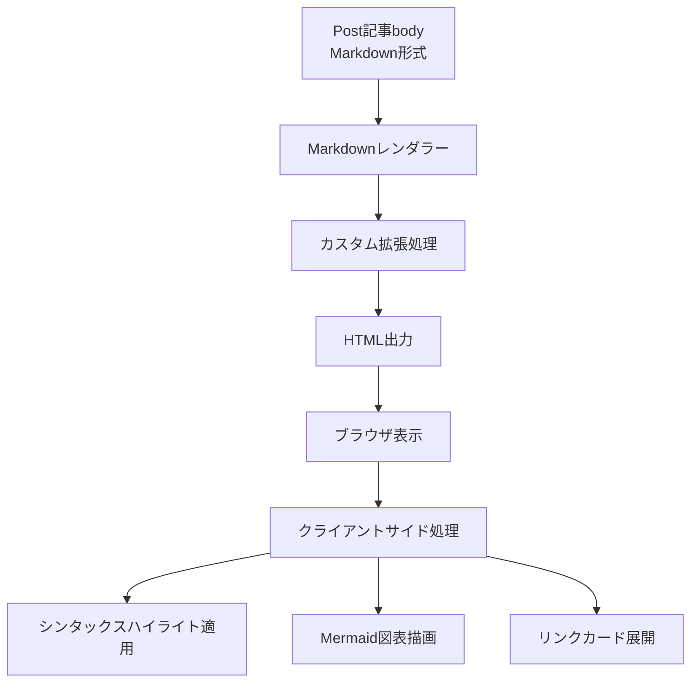

# 機能設計書: Markdownレンダリング機能

## 文書管理情報

| 項目 | 内容 |
|------|------|
| 文書ID | DES-2026-001 |
| 関連要件定義書 | REQ-2026-001 |
| 作成日 | 2026-01-07 |
| 最終更新日 | 2026-01-07 |
| ステータス | Draft |

## 1. 機能概要

### 1.1 目的

Post記事のMarkdown形式テキストを、技術記事として適切な表現力を持つHTMLに変換する機能を提供する。コードブロックのシンタックスハイライト、図表描画、リンクカード、拡張画像表示など、技術記事に特化した表示機能を実現する。

### 1.2 スコープ

- Post記事のbodyフィールド（Markdown形式）のHTML変換処理
- 記事詳細ページおよび記事一覧ページでの表示
- 5つのカスタムMarkdown拡張機能の実装

## 2. システム構成

### 2.1 処理の全体像

### 2.2 責務の分離

**サーバーサイド処理:**
- Markdown→HTML基本変換
- カスタム拡張の前処理・後処理
- セキュリティ属性の付与

**クライアントサイド処理:**
- シンタックスハイライトの適用
- コピーボタンの生成・動作
- Mermaid図表のレンダリング
- リンクカード情報の取得・表示

## 3. コアドメイン設計

### 3.1 Markdownレンダラー

#### 責務
- Markdown形式テキストをHTMLに変換する
- 標準Markdown構文をサポートする
- カスタム拡張機能を適用する

#### 入力
- Markdown形式のテキスト（Post#body）

#### 出力
- HTML形式のテキスト
- セキュリティ属性が付与されたHTML

#### 処理フロー
1. **前処理**
   - URLのみの行を検出し、リンクカード用のHTMLに変換
   - キャプション付き画像を検出し、figure要素に変換
2. **Markdown→HTML変換**
   - 標準Markdown構文を処理
   - コードブロックをカスタムハンドラーで処理
3. **後処理**
   - 画像要素をfigure要素でラップ
   - 幅指定の抽出と適用

### 3.2 カスタムMarkdown拡張

#### 3.2.1 シンタックスハイライト拡張

**責務:**
- コードブロックをシンタックスハイライト可能な形式に変換する
- ファイル名表示機能をサポートする

**入力:**
- コード内容
- 言語指定（例: `ruby`, `bash:~/.bashrc`）

**出力:**
- 言語クラスが付与されたHTML
- ファイル名付きコードブロックのHTML

**処理フロー:**
1. **言語指定の解析**
   - 言語文字列に`:` が含まれる場合、言語とファイル名に分離
   - 例: `bash:~/.bashrc` → 言語: `bash`, ファイル名: `~/.bashrc`
2. **HTML生成**
   - ファイル名がある場合: ファイル名表示付きHTML構造を生成
   - ファイル名がない場合: 通常のコードブロックHTML構造を生成
3. **エスケープ処理**
   - コード内容、言語、ファイル名をHTMLエスケープ

**HTML構造（設計レベル）:**
- ファイル名付き: コンテナ要素内にファイル名表示要素とコードブロック要素
- 通常: preタグ内にcodeタグ、言語クラスを付与

#### 3.2.2 Mermaid図表拡張

**責務:**
- Mermaid記法のコードブロックを図表描画用の形式に変換する

**入力:**
- Mermaid記法のコード
- 言語指定 `mermaid`

**出力:**
- Mermaid図表描画用のHTML構造

**処理フロー:**
1. **言語判定**
   - 言語が`mermaid`の場合のみ処理
2. **HTML生成**
   - Mermaidソースコードを非表示要素に格納
   - 描画先要素を生成
   - クライアントサイドコントローラー用の属性を付与

#### 3.2.3 リンクカード拡張

**責務:**
- URLのみの行をリンクカード表示用の形式に変換する

**入力:**
- URLのみが記載された行

**出力:**
- リンクカード用のHTML構造

**処理フロー:**
1. **URL検出**
   - 行の先頭から末尾までがURL（`http://`または`https://`で始まる）
2. **HTML生成**
   - リンクカード用のコンテナ要素を生成
   - URLをdata属性に設定
   - フォールバック用の通常リンクを含める
   - クライアントサイドコントローラー用の属性を付与

**セキュリティ考慮:**
- 外部リンクには`target="_blank"`と`rel="noopener"`を付与

#### 3.2.4 拡張画像表示機能

**責務:**
- Markdown画像構文を拡張し、幅指定とキャプション表示をサポートする

**入力パターン:**
1. 通常画像: ``
2. 幅指定画像: ``
3. キャプション付き画像: `\n*caption*`
4. リンク付き画像: ``

**出力:**
- figure要素でラップされた画像HTML

**処理フロー:**

**前処理段階:**
1. **キャプション付き画像の検出**
   - 画像構文の直後に改行と斜体テキストがある場合
   - figure要素に画像とfigcaption要素を含めたHTMLを生成

**後処理段階:**
2. **リンク付き画像の検出**
   - pタグ内のaタグで囲まれたimgタグを検出
   - figure要素でラップし、リンクを保持
3. **通常画像の変換**
   - pタグ内のimgタグを検出
   - figure要素でラップ

**幅指定の処理:**
- 画像パスから`=XXXpx`形式の幅指定を抽出
- 幅指定があればstyle属性に設定

**HTML構造（設計レベル）:**
- figure要素
  - 画像要素（リンク付きの場合はaタグで囲む）
  - キャプションがある場合はfigcaption要素

#### 3.2.5 拡張機能の統合

**責務:**
- 各拡張機能をレンダラーに登録する
- 拡張機能間の実行順序を制御する

**処理順序:**
1. LinkCardExtension（前処理）
2. ImageExtension（前処理）
3. Markdown本体の変換
4. MermaidExtension（コードブロック処理）
5. SyntaxHighlightExtension（コードブロック処理）
6. ImageExtension（後処理）
7. HTMLサニタイズ（最終処理）

### 3.3 HTMLサニタイザー

#### 責務
- 変換後のHTMLから危険なタグ・属性を除去する
- XSS攻撃のリスクを軽減する

#### 入力
- カスタム拡張処理を経たHTML文字列

#### 出力
- サニタイズされた安全なHTML文字列

#### 処理フロー
1. **許可リスト方式**
   - 安全なタグと属性のみを許可
   - 許可リスト以外の要素を除去
2. **除去対象**
   - scriptタグ
   - iframeタグ
   - embedタグ、objectタグ
   - onclick等のイベントハンドラー属性
   - javascript:スキームのURL
3. **保持対象**
   - Markdownから生成される標準的なタグ（p, h1-h6, ul, ol, li, a, img, code, pre等）
   - カスタム拡張で生成されるdata属性（data-controller等）
   - スタイル属性（幅指定などで使用）

#### セキュリティ上の考慮事項

**脅威:**
- AI生成記事の元となるGitHubリポジトリコードに含まれるscriptタグやイベントハンドラーが記事に混入する可能性

**対策:**
- HTMLサニタイズによる危険要素の除去（第二の防御層）
- CSPによるスクリプト実行の制限（第一の防御層）
- 多層防御アプローチにより、一つの防御が突破されても安全性を確保

### 3.4 クライアントサイド処理

#### 3.4.1 シンタックスハイライトコントローラー

**責務:**
- コードブロックにシンタックスハイライトを適用する
- コピーボタンを生成・管理する

**処理フロー:**
1. **初期化**
   - ページ読み込み時に自動実行
   - highlight.jsライブラリの読み込みを待機
2. **ハイライト適用**
   - コードブロック要素を検索
   - 各コードブロックにシンタックスハイライトを適用
   - 既にハイライト済みの要素はスキップ
3. **コピーボタン生成**
   - 各コードブロックにコピーボタンを追加
   - 既にボタンが存在する場合はスキップ
4. **コピー処理**
   - ボタンクリック時にコードをクリップボードにコピー
   - 成功時は視覚的フィードバックを表示
   - 失敗時はフォールバック処理を実行

**コピーボタンの仕様:**
- 配置: コードブロックの右上
- 表示: アイコンと"Copy"テキスト
- フィードバック: コピー成功時にチェックアイコンと"Copied!"に変化
- フィードバック期間: 2秒後に元の表示に戻る

**フォールバック処理:**
- Clipboard APIが利用できない場合、非表示のtextarea要素を使用
- 古いブラウザ対応のためのexecCommand方式

## 4. データ設計

### 4.1 入力データ

**Post#body:**
- データ型: TEXT
- 形式: Markdown
- 文字エンコーディング: UTF-8

### 4.2 出力データ

**HTML（変換後）:**
- データ型: String
- 形式: HTML5
- セキュリティ属性: 外部リンクに`rel="noopener"`

## 5. セキュリティ設計

### 5.1 多層防御アーキテクチャ

**基本方針:**
- 複数の防御層を組み合わせた多層防御アプローチを採用
- 一つの防御が突破されても、他の防御層で攻撃を阻止

**防御層:**
1. **第一層: Content Security Policy（CSP）**
   - アプリケーション全体でスクリプト実行を制限
   - 最も強力な防御だが、設定ミスのリスクあり
2. **第二層: HTMLサニタイズ**
   - 危険なタグ・属性を除去
   - CSPを補完する役割

### 5.2 XSS対策

#### 5.2.1 HTMLサニタイズ

**目的:**
- GitHubリポジトリコードに含まれるscriptタグやイベントハンドラーが記事に混入するリスクへの対処

**処理方式:**
- 許可リスト方式（安全な要素のみを許可）
- 変換後のHTMLに対して実行

**許可する要素:**
- 標準Markdownタグ: p, h1-h6, ul, ol, li, a, img, code, pre, blockquote, table等
- カスタム拡張タグ: div, figure, figcaption
- カスタム属性: data-controller, data-*（Stimulus用）
- スタイル属性: style（画像幅指定用）

**除去する要素:**
- scriptタグ
- iframeタグ
- embedタグ、objectタグ
- イベントハンドラー属性（onclick, onerror等）
- javascript:スキームのURL

#### 5.2.2 Content Security Policy（CSP）

**CSPディレクティブ（推奨）:**
- `script-src 'self' cdn.jsdelivr.net`: 自ドメインとCDNのみ許可
- `style-src 'self' 'unsafe-inline'`: インラインスタイル許可（highlight.js、Mermaidで必要）
- `img-src *`: 画像URLを制限しない（記事内の画像用）
- `default-src 'self'`: その他は自ドメインのみ

**効果:**
- HTMLサニタイズをすり抜けたスクリプトの実行を防止
- 多層防御の第一層として機能

### 5.3 外部リンクの安全性

**処理:**
- すべての外部リンクに`rel="noopener"`を付与
- `target="_blank"`で新しいタブで開く

**理由:**
- `noopener`: リンク先ページから元ページへのアクセスを防止
- Tabnabbing攻撃の防止

## 6. UI/UX設計

### 6.1 コードブロック表示

**視覚的特徴:**
- 背景色: コードブロック用の背景色（通常の本文と区別）
- フォント: 等幅フォント
- シンタックスハイライト: 言語に応じた色付け
- コピーボタン: 右上に配置、ホバー時に視覚的変化

**ファイル名表示:**
- 位置: コードブロックの上部
- スタイル: 小さめのフォント、等幅フォント

### 6.2 図表表示

**Mermaid図表:**
- レンダリング領域: コンテンツ幅に合わせて調整
- フォールバック: JavaScriptが無効な場合はソースコードを表示

### 6.3 リンクカード

**表示形式:**
- カード型UI
- クリック可能領域: カード全体
- ホバー効果: 視覚的フィードバック

### 6.4 画像表示

**レスポンシブ対応:**
- 最大幅: コンテンツ領域の幅に合わせる
- アスペクト比: 維持する
- 幅指定: 指定された場合でもコンテンツ幅を超えない

**キャプション:**
- 位置: 画像の下
- スタイル: 小さめのフォント、中央寄せ

## 7. パフォーマンス設計

### 7.1 レンダリング方式

**タイミング:**
- 記事表示時にMarkdown→HTML変換を実行
- ビュー表示時に毎回変換（Phase 1）

**将来的な最適化（Phase 2以降）:**
- 変換結果のキャッシュ
- 記事更新時のキャッシュクリア

### 7.2 クライアントサイド処理の最適化

**段階的レンダリング:**
1. 基本HTML構造の表示（サーバーサイド処理）
2. シンタックスハイライトの適用（クライアントサイド）
3. 図表の描画（クライアントサイド）

**利点:**
- 初期表示の高速化
- JavaScriptが無効でも基本的な閲覧が可能

## 8. エラーハンドリング

### 8.1 Markdown変換エラー

**想定エラー:**
- 不正なMarkdown構文
- サポート外の構文

**対応:**
- エラーが発生した部分をプレーンテキストとして表示
- ログに警告を記録

### 8.2 クライアントサイドエラー

**シンタックスハイライト:**
- highlight.jsが読み込めない場合、プレーンコードブロックを表示

**Mermaid図表:**
- Mermaid.jsが読み込めない場合、ソースコードを表示

**コピー機能:**
- Clipboard APIが利用できない場合、フォールバック処理を実行
- フォールバックも失敗した場合、エラーメッセージを表示

## 9. テスト設計

### 9.1 単体テスト

**テスト対象:**
- Markdownレンダラー
- 各カスタム拡張機能

**テストケース（例）:**
- 標準Markdown構文の変換
- コードブロックのHTML生成
- ファイル名の解析と分離
- URL検出とリンクカード化
- 画像構文の変換と幅指定の抽出
- キャプション付き画像の処理
- HTMLサニタイズ（scriptタグ、イベントハンドラー等の除去）

### 9.2 統合テスト

**テスト対象:**
- Post記事の表示
- クライアントサイド処理の動作

**テストケース（例）:**
- 記事詳細ページでMarkdownが正しくHTMLに変換される
- コードブロックにコピーボタンが表示される
- コピーボタンが正常に動作する
- Mermaid図表が描画される
- リンクカードが表示される

### 9.3 ブラウザテスト

**対象ブラウザ:**
- Chrome（最新版）
- Firefox（最新版）
- Safari（最新版）
- Edge（最新版）

**確認項目:**
- シンタックスハイライトの表示
- コピーボタンの動作
- 図表の描画
- レスポンシブ対応

## 10. 運用設計

### 10.1 モニタリング

**監視項目:**
- Markdown変換エラーの発生頻度
- クライアントサイドJavaScriptエラーの発生頻度

### 10.2 ログ設計

**記録内容:**
- Markdown変換時のエラー
- サポート外の構文の使用

**ログレベル:**
- ERROR: 変換失敗
- WARN: サポート外の構文

## 11. 制約事項・前提条件

### 11.1 技術的制約

- Markdownエンジン: redcarpet
- シンタックスハイライトライブラリ: highlight.js
- 図表描画ライブラリ: Mermaid.js
- フロントエンドフレームワーク: Stimulus

### 11.2 前提条件

- Post#bodyには有効なMarkdown形式のテキストが保存されている
- 記事はAI生成コンテンツであり、ユーザー入力は想定しない
- ブラウザはJavaScriptが有効である（シンタックスハイライトと図表描画）

## 12. 参考資料

### 12.1 関連文書

- 要件定義書: REQ-2026-001

### 12.2 参考実装

- rails-spotlightプロジェクト
  - カスタムMarkdown拡張実装
  - シンタックスハイライトコントローラー実装

### 12.3 外部仕様

- Redcarpet: https://github.com/vmg/redcarpet
- highlight.js: https://highlightjs.org/
- Mermaid.js: https://mermaid.js.org/

## 13. 変更履歴

| 日付 | バージョン | 変更内容 | 作成者 |
|------|------------|----------|--------|
| 2026-01-07 | 1.0 | 初版作成 | Claude |
