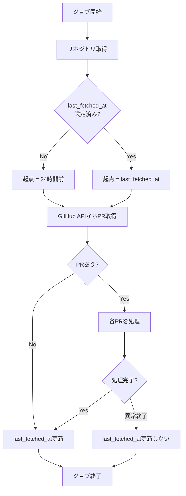

# Pull Request取得漏れ防止機能 機能設計書

**機能名**: Pull Request取得漏れ防止機能
**バージョン**: 1.0
**作成日**: 2026年1月10日
**更新日**: 2026年1月10日

> **設計書作成ガイドライン**
>
> この機能設計書は、実装の詳細に影響されないコアドメインの設計を記載します。
> 具体的なクラス設計や実装詳細は、実装中の改善によって変化するため、
> 以下の点を重視して作成してください：
>
> - **責務の明確化**: 何をする処理かを明確に定義
> - **入出力の仕様**: 処理に必要な入力と期待される出力
> - **処理フローの概要**: 大まかな処理手順（実装方法は含めない）
> - **抽象度の保持**: 具体的なクラス名・メソッド名は記載しない
> - **ドメイン知識の記録**: 業務ルールやビジネス制約を重視

## 1. 機能概要

### 1.1 目的

- ジョブ実行間隔と取得対象期間のずれによるPull Request取得漏れを防止する
- リポジトリごとに最終取得日時を管理し、その日時以降のPRを確実に取得する

### 1.2 主要機能

1. **最終取得日時の管理**: リポジトリごとにPRを最後に取得した日時を記録・参照する
2. **期間指定によるPR取得**: 固定の24時間ではなく、最終取得日時から現在までのPRを取得する
3. **トランザクション的な日時更新**: ジョブ正常完了時のみ最終取得日時を更新する

### 1.3 処理フロー概要

#### 1.3.1 取得期間の決定
1. 対象リポジトリの最終取得日時（last_fetched_at）を参照する
2. 最終取得日時が未設定（NULL）の場合、24時間前を起点とする
3. 最終取得日時が設定済みの場合、その日時を起点とする

#### 1.3.2 Pull Requestの取得と処理
4. 起点日時から現在までにマージされたPRをGitHub APIから取得する
5. 既存の重複チェック（source_urlによる判定）でスキップ判定を行う
6. 各PRについて記事生成処理を実行する

#### 1.3.3 最終取得日時の更新
7. すべてのPR処理が正常に完了した場合、最終取得日時を現在時刻に更新する
8. 処理中に異常終了した場合、最終取得日時は更新しない

## 2. データ要件

### 2.1 リポジトリマスタ（既存テーブル拡張）

**テーブル名**: `repositories`

| 項目名 | キー | データ型 | 必須 | 説明 |
|--------|------|----------|------|------|
| id | PK | bigint | ○ | 主キー |
| name | UK | string | ○ | リポジトリ名（owner/repo形式） |
| url | | string | ○ | リポジトリURL |
| last_fetched_at | | datetime | - | 最終取得日時（新規追加） |
| created_at | | datetime | ○ | 作成日時 |
| updated_at | | datetime | ○ | 更新日時 |

**追加項目**:
- last_fetched_at: NULL許容、タイムゾーン付き日時型

**データ更新タイミング**:
- ジョブが正常に完了した時点で現在時刻に更新

## 3. 計算ロジック

### 3.1 取得起点日時の決定

```
取得起点日時 = last_fetched_at が NULL の場合 → 現在時刻 - 24時間
             last_fetched_at が設定済みの場合 → last_fetched_at
```

### 3.2 取得対象PRの判定

```
取得対象 = マージ日時（merged_at） >= 取得起点日時 のPull Request
```

## 4. ビジネスルール

### 4.1 最終取得日時の更新ルール

#### 4.1.1 更新条件
- **正常完了時**: すべてのPR処理が完了した時点で、最終取得日時を現在時刻に更新する
- **異常終了時**: 最終取得日時を更新しない（次回実行時に同じ期間を再取得可能とする）

#### 4.1.2 更新タイミング
- 更新はジョブ処理の最後に行う
- 個々のPR処理の成否にかかわらず、ジョブ全体が完了した時点で更新する

### 4.2 重複防止ルール

#### 4.2.1 二重取得の防止
- 最終取得日時を起点とすることで、同じPRを複数回取得することを防ぐ
- ただし、既存のsource_urlによる重複チェックも維持する（フェイルセーフ）

#### 4.2.2 取得漏れの防止
- ジョブ異常終了時は最終取得日時を更新しないことで、次回実行時に再取得を可能にする

### 4.3 初回実行ルール

#### 4.3.1 新規リポジトリ追加時
- last_fetched_atはNULLで初期化される
- 初回ジョブ実行時は過去24時間分のPRを取得する

## 5. バッチ処理機能

### 5.1 処理フロー



### 5.2 トリガーイベント

- 定期実行（既存のスケジューラ設定に従う）
- 手動実行（リポジトリIDまたは名前を指定）

### 5.3 前提条件

- リポジトリがrepositoriesテーブルに登録済みであること
- GitHub APIアクセストークンが設定されていること

## 6. エラーハンドリング

### 6.1 エラー分類

| エラーレベル | 説明 | 処理継続 | last_fetched_at更新 |
|-------------|------|----------|---------------------|
| CRITICAL | GitHub API認証エラー | 中止 | しない |
| ERROR | 個別PR処理エラー | 継続 | する |
| WARNING | PRフィルタリングによるスキップ | 継続 | する |

### 6.2 リトライ戦略

- 個別PR処理でエラーが発生した場合、該当PRはスキップして次のPRへ進む
- ジョブ全体が異常終了した場合、次回実行時に再取得される

---

**関連資料**:
- [Pull Request取得漏れ防止機能 要件定義書](../requirements/pr-fetch-gap-prevention.md)
